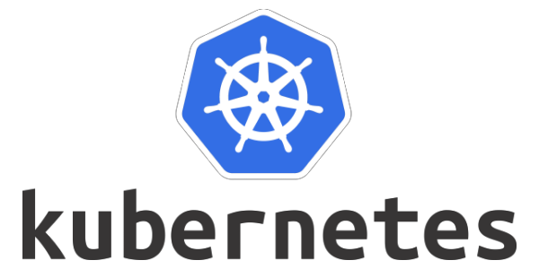

# Operationalize a Machine Learning Microservice API

> This project demonstrates operationalization of a Python flask app that serves out predictions (inference) about housing prices through API calls. The app uses a pre-trained, sklearn model that has been trained to predict housing prices in Boston according to several features, such as average rooms in a home and data about highway access, teacher-to-pupil ratios, and so on. You can read more about the data, which was initially taken from Kaggle, on [the data source site](https://www.kaggle.com/c/boston-housing).

## Getting Setup

### Setting up the Environment

* Create a virtualenv and activate it
* Run `make install` to install the necessary dependencies

### Running `app.py`

1. Standalone:  `python app.py`
2. Run in Docker:  `./run_docker.sh`
3. Run in Kubernetes:  `./run_kubernetes.sh`

### Kubernetes-Specific Steps

* Setup and Configure Docker locally
* Setup and Configure Kubernetes locally
* Create a Flask app in a Container
* Run via kubectl 
* You can choose to run one cluster locally with [Minikube](https://kubernetes.io/docs/tasks/tools/install-minikube/)

## Built With

* [Kubernetes](https://kubernetes.io/) - Automating deployment system used
* [Python](https://www.python.org/) - The programming language used
* [Boston Housing](https://www.kaggle.com/c/boston-housing) - Kaggle Data source

## Authors

* **[Pemberai Sweto](https://github.com/thepembeweb)** - *Initial work* - [Operationalize a Machine Learning Microservice API](https://github.com/thepembeweb/proj-ml-microservice-kubernetes)

## License

- This project is licensed under the MIT License - see the [LICENSE.md](LICENSE.md) file for details
- Copyright 2020 © [Pemberai Sweto](https://github.com/thepembeweb).

